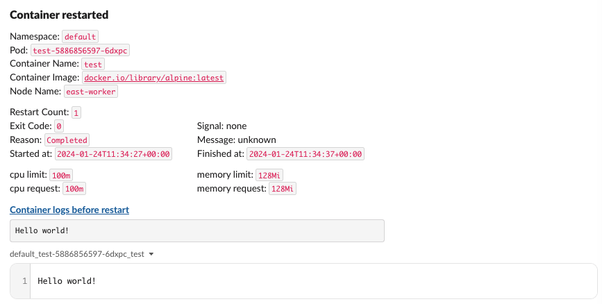

# johari-mirror

[](https://github.com/flywheel-jp/johari-mirror/actions/workflows/rust.yml)

johari-mirror monitors a Kubernetes cluster to detect container restarts and
notify restart reasons and logs to Slack.

## Overview

johari-mirror collects information about restarted containers and post notifications
to Slack like following.



## Installation

You can use [example.yaml](deployment/example.yaml) to deploy johari-mirror to your
Kubernetes cluster with `NAMESPACE` and `NOTIFICATION_CHANNEL` replaced.

```sh
kubectl create secret generic johari-mirror-slack-api-token \
  --from-literal=token=<your-slack-token>
kubectl apply -f example.yaml
```

### Environment variables

All environment variables are required.

| Name | Description |
|:--|:--|
| `SLACK_TOKEN` | Slack Bot User OAuth Token. See Slack authentication section. |
| `SLACK_NOTIFICATION_CONFIG` | Filters to configure notification destination. See the following section. |

#### SLACK_NOTIFICATION_CONFIG

`SLACK_NOTIFICATION_CONFIG` environment variable defines a list of rules to configure
notification destination delimited by commas in
`namespace/pod/container=channel,...,namespace/pod/container=channel` format.

- When a container restart is detected, johari-mirror determines the Slack channel
  to send notification by its `namespace`, `pod` name and `container` name.
- Earlier rules have higher priority.
- Each of `namespace`, `pod` or `container` in a rule may contain `*` wildcards.
- `channel` can be either of a Slack channel name, a Slack channel ID or
  an empty string. Empty string suppresses notification.

Examples

- `*/*/*=monitoring`
  - Any container restarts are notified to `monitoring` Slack channel.
- `kube-system/coredns-*/*=monitoring-coredns,kube-system/*/*=,*/*/*=monitoring`
  - Restarts of pods beginning with `coredns-` in `kube-system` namespace are notified
    to `monitoring-coredns` channel.
  - Restarts of other pods in `kube-system` namespace are not notified.
  - Restarts in the other namespaces are notified to `monitoring` channel.

### Slack authentication

Ref: [Quickstart | Slack](https://api.slack.com/start/quickstart)

Create a Slack App and install it to your workspace.
johari-mirror uses
[`Bot User OAuth Token`](https://api.slack.com/authentication/token-types#bot)
in the environment variable `SLACK_TOKEN`.

#### Required permission scopes

- Bot Token Scopes
  - `chat:write.public` or `chat:write`
    - With `chat:write`, the app needs to be invited to the target Slack channels.
  - `files:write`

### Kubernetes authentication

Kubernetes authentication can be obtained from `KUBECONFIG`, `~/.kube/config` or
in-cluster config.

Ref. [Config in kube - Rust](https://docs.rs/kube/latest/kube/struct.Config.html#method.infer)

See [example manifest](deployment/example.yaml) for authentication using ServiceAccount.

#### Required permissions

- Resources: `pods`, `pods/log`
- Verbs: `get`, `watch`, `list`

## License

MIT

## Related projects

- [airwallex/k8s-pod-restart-info-collector](https://github.com/airwallex/k8s-pod-restart-info-collector)
